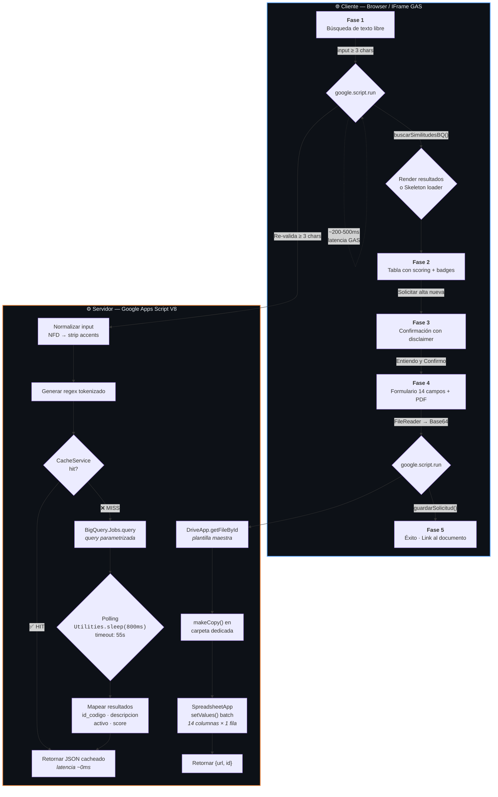
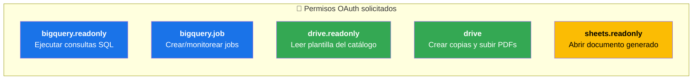
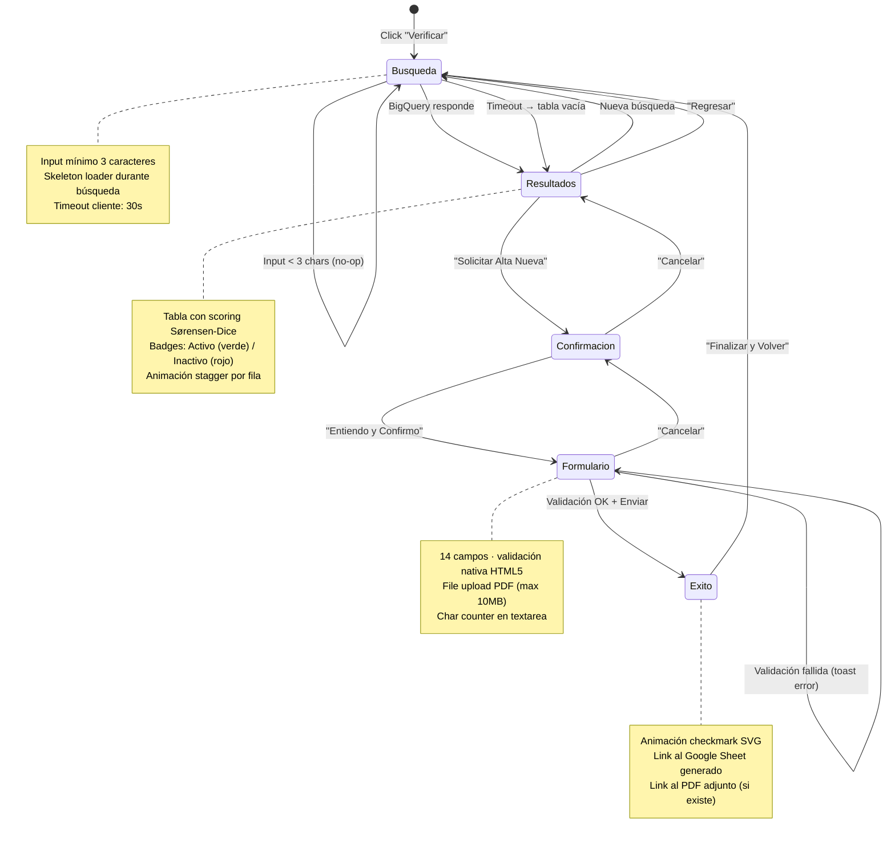

<p align="center">
  
  
  
  
  <br>
  
  
  
  
  
</p>

---

<div align="center">

# Verificador de Catálogo HCG

### Hospital Civil de Guadalajara · Sistema de Prevención de Duplicados

**Búsqueda semántica · Prevención de duplicados · Generación automática de formatos de inclusión**


</div>

---

<div align="center">

**[`Documentación Técnica`](#-documentación-técnica)**
·
**[`Despliegue`](#-despliegue)**
·
**[`API Reference`](#-referencia-de-la-api)**
·
**[`Roadmap`](#-roadmap)**
·
**[`Troubleshooting`](#-solución-de-problemas)**

</div>

---

## Índice

<details>
<summary><strong>Clic para expandir índice completo</strong></summary>

| #   | Sección                                                 | Descripción                               |
| --- | ------------------------------------------------------- | ----------------------------------------- |
| 1   | [Descripción General](#1-descripción-general)           | Resumen ejecutivo y stack técnico         |
| 2   | [Arquitectura del Sistema](#2-arquitectura-del-sistema) | Diagramas de flujo y flujo de datos       |
| 3   | [Estructura del Proyecto](#3-estructura-del-proyecto)   | Árbol de archivos y responsabilidades     |
| 4   | [Configuración](#4-configuración)                       | Variables de entorno, recursos y permisos |
| 5   | [Base de Datos BigQuery](#5-base-de-datos-bigquery)     | Esquema, algoritmo y optimizaciones       |
| 6   | [Referencia de la API](#6-referencia-de-la-api)         | Contratos de funciones servidor           |
| 7   | [Interfaz de Usuario](#7-interfaz-de-usuario-indexhtml) | Patrones de diseño y tokens               |
| 8   | [Seguridad](#8-seguridad)                               | Sanitización, inyección y dominio         |
| 9   | [Despliegue](#9-despliegue)                             | Checklist de producción                   |
| 10  | [Solución de Problemas](#10-solución-de-problemas)      | Diagnóstico y modo debug                  |
| 11  | [Roadmap](#11-roadmap)                                  | Versiones actuales y planificadas         |

</details>

---

## 1. Descripción General

**Verificador de Catálogo HCG** es una aplicación web integrada en Google Apps Script que implementa un flujo de **5 fases** para la prevención de duplicados en el catálogo maestro hospitalario del Hospital Civil de Guadalajara.

### Flujo funcional en 5 fases

```

┌──────────────┐ ┌──────────────┐ ┌──────────────┐ ┌──────────────┐ ┌──────────────┐
│ │ │ │ │ │ │ │ │ │
│ FASE 1 │───▶│ FASE 2 │───▶│ FASE 3 │───▶│ FASE 4 │───▶│ FASE 5 │
│ Búsqueda │ │ Resultados │ │ Confirmación │ │ Formulario │ │ Éxito │
│ │ │ │ │ │ │ │ │ │
│ Texto libre │ │ Tabla scoring│ │ Disclaimer │ │ 14 campos │ │ Link Sheet │
│ → BigQuery │ │ + badges │ │ + warning │ │ + PDF adj. │ │ generado │
│ │ │ │ │ │ │ │ │ │
└──────────────┘ └──────────────┘ └──────────────┘ └──────────────┘ └──────────────┘
▲ │
└──────────────────────────────────────────────────────────────────────────────────────┘
Reiniciar flujo

```

### Stack técnico

<table>
<tr>
<td align="center"><strong>Capa</strong></td>
<td align="center"><strong>Tecnología</strong></td>
<td align="center"><strong>Detalle</strong></td>
</tr>
<tr>
<td>🖥️ Frontend</td>
<td>HTML5 Service · CSS vanilla · JavaScript ES2020</td>
<td>SPA monolítica en un solo archivo <code>index.html</code></td>
</tr>
<tr>
<td>⚙️ Backend</td>
<td>Google Apps Script (V8 Runtime)</td>
<td>5 funciones públicas + 2 helpers privados</td>
</tr>
<tr>
<td>🗄️ Base de datos</td>
<td>Google BigQuery</td>
<td>Búsqueda semántica con coeficiente de Sørensen-Dice</td>
</tr>
<tr>
<td>📁 Almacenamiento</td>
<td>Google Drive · Google Sheets</td>
<td>Documentos generados + plantilla maestra</td>
</tr>
<tr>
<td>⚡ Cache</td>
<td><code>CacheService.getScriptCache()</code></td>
<td>TTL de 6 horas · Clave MD5 de 24 caracteres</td>
</tr>
<tr>
<td>🎨 Tipografía</td>
<td>Google Fonts (DM Sans)</td>
<td>400 · 500 · 600 · 700</td>
</tr>
</table>

---

## 2. Arquitectura del Sistema

### Diagrama de arquitectura de alto nivel



### Flujo de datos detallado

```
┌─────────────────────────────────────────────────────────────────────────┐
│                        FLUJO DE DATOS COMPLETO                          │
└─────────────────────────────────────────────────────────────────────────┘

  Usuario ingresa texto libre
       │
       ▼
  ┌────────────────────────────────────────────────────────────────────┐
  │  CLIENTE JS (index.html)                                           │
  │                                                                    │
  │  1. toUpperCase()                                                  │
  │  2. NFD normalization → strip diacriticals                         │
  │  3. Filtro: palabras con length ≥ 3 chars → max 15 tokens          │
  │  4. Regex escapada: inputWords.map(escapeRegex).join('|')          │
  │  5. Invoca: google.script.run.buscarSimilitudesBQ(texto, regex)    │
  └────────────────────────────┬───────────────────────────────────────┘
                               │ google.script.run (~200-500ms latencia)
                               ▼
  ┌────────────────────────────────────────────────────────────────────┐
  │  SERVIDOR GAS (Code.gs)                                            │
  │                                                                    │
  │  1. Re-valida longitud ≥ 3                                         │
  │  2. ┌─ Cache HIT → return JSON.parse(cached)     [~0ms]           │
  │     └─ Cache MISS ↓                                                │
  │  3. BigQuery.Jobs.query                                            │
  │     ├── @q     : texto original (sin normalizar)                   │
  │     └── @regex : regex escapado para REGEXP_CONTAINS               │
  │  4. Polling: Utilities.sleep(800ms) × N iteraciones (max 55s)     │
  │  5. Mapeo: {id_codigo, descripcion, activo, similitud}             │
  │  6. Cache.put(key, JSON, 21600)                                    │
  │  7. return Array<Resultado>                                        │
  └────────────────────────────┬───────────────────────────────────────┘
                               │
                               ▼
  ┌────────────────────────────────────────────────────────────────────┐
  │  CLIENTE JS (index.html)                                           │
  │                                                                    │
  │  1. renderSkeleton() → renderResultados(data)                      │
  │  2. Stagger animation: 40ms delay por fila                         │
  │  3. UX: skeleton → tabla con badges de estado                      │
  └────────────────────────────────────────────────────────────────────┘
       │
       ▼  (Si usuario decide solicitar alta nueva)
  ┌────────────────────────────────────────────────────────────────────┐
  │  SERVIDOR GAS (Code.gs) → guardarSolicitud(payload)                │
  │                                                                    │
  │  1. getCarpetaSolicitudes() → DriveApp.getFoldersByName()          │
  │  2. generarDocumentoInclusion(datosDoc, pdfBase64)                 │
  │     ├── plantilla.makeCopy(nombre, carpetaDestino)                 │
  │     ├── SpreadsheetApp.open(copia).getSheetByName('Formato')       │
  │     ├── hoja.getRange(14, 3, 1, 14).setValues(batch)              │
  │     ├── [Opcional] DriveApp.createFile(blob) ← PDF adjunto        │
  │     └── SpreadsheetApp.flush()                                     │
  │  3. return { success: true, url, id }                              │
  └────────────────────────────────────────────────────────────────────┘
```

---

## 3. Estructura del Proyecto

```
hcg-catalogo-verifier/
│
├── appsscript.json              # ⚙️  Manifest del proyecto GAS
│   ├── runtimeVersion           #     "V8"
│   ├── webapp.executeAs         #     "USER_DEPLOYING"
│   ├── webapp.access            #     "DOMAIN"
│   └── dependencies.enabledAdvancedServices
│       ├── bigquery             #     Búsqueda semántica
│       ├── drive                #     Gestión de documentos
│       └── sheets               #     Plantilla + generación
│
├── Code.gs                      # 🖥️  Lógica del servidor
│   │
│   │   ── Funciones públicas (expuestas al cliente) ──
│   ├── doGet()                         Punto de entrada HTML Service
│   ├── buscarSimilitudesBQ()           Motor de búsqueda semántica
│   └── guardarSolicitud()              Orquestador de alta + documento
│   │
│   │   ── Helpers privados ──
│   ├── generarDocumentoInclusion()     Generador de Google Sheets
│   └── getCarpetaSolicitudes()         Gestor de carpeta Drive
│
└── index.html                   # 🎨 Interfaz completa (SPA · 5 fases)
    │
    ├── <style>                  # ~620 líneas CSS
    │   ├── Variables CSS        #     27 custom properties (:root)
    │   ├── Layout               #     Flexbox / CSS Grid
    │   ├── Componentes          #     stepper · skeleton · modal · toast · badges
    │   ├── Animaciones          #     @keyframes · transitions · stagger
    │   ├── Responsive           #     @media (max-width: 600px)
    │   └── Accesibilidad        #     prefers-reduced-motion
    │
    ├── <body>                   # HTML semántico con ARIA
    │   ├── nav[stepper]         #     Indicador de progreso (5 pasos)
    │   ├── section[phase-1]     #     Búsqueda (input + loader + skeleton)
    │   ├── section[phase-2]     #     Resultados (tabla + badges + stagger)
    │   ├── section[phase-3]     #     Confirmación (disclaimer warning)
    │   ├── section[phase-4]     #     Formulario (14 campos + file upload)
    │   └── section[phase-5]     #     Éxito (checkmark animado + link)
    │
    └── <script>                 # ~400 líneas JavaScript
        ├── Estado               #     flags concurrencia · timeout · currentPhase
        ├── Navegación           #     irFase(num, force) · transiciones bidir.
        ├── Búsqueda             #     ejecutarBusqueda() · skeleton · timeout 30s
        ├── Renderizado          #     renderResultados() · renderSkeleton()
        ├── Validación           #     enviarFormulario() · checkValidity + PDF
        ├── UI                   #     showToast() · showModal() · ripple()
        └── Utilidades           #     escapeHTML() · $() · escapeRegex()
```

---

## 4. Configuración

### 4.1 Variables de entorno obligatorias

> **Ubicación:** Google Apps Script → Proyecto ⚙️ → Configuración del proyecto → Variables de entorno

| Variable        | Descripción         |   Tipo   | Ejemplo                 |     Requerido      |
| :-------------- | :------------------ | :------: | :---------------------- | :----------------: |
| `BQ_PROJECT_ID` | ID del proyecto GCP | `string` | `hcg-catalogo-prod`     |         ✅         |
| `BQ_DATASET`    | Dataset en BigQuery | `string` | `hcg_catalogo`          |         ✅         |
| `BQ_TABLE`      | Tabla del catálogo  | `string` | `catalogo_articulos_v2` |         ✅         |
| `BQ_LOCATION`   | Región de BigQuery  | `string` | `US`                    | ❌ (default: `US`) |

### 4.2 Recursos externos

| Recurso                    | Identificador                                  | Descripción                                      |
| :------------------------- | :--------------------------------------------- | :----------------------------------------------- |
| 📊 Plantilla Google Sheets | `1ZVwPuloDIcDfQJFuZs_AeEb8SH5TD0iRbEx3kER_GC8` | Hoja `"Formato"` con mapeo de celdas predefinido |
| 🖼️ Logo HCG                | `1DgdE3nJmkNA9fMq4OQHpYYExy7E_jsjF`            | Imagen PNG servida vía Google Drive              |

### 4.3 Permisos OAuth requeridos



| Permiso             | Justificación                       | Scope     |
| :------------------ | :---------------------------------- | :-------- |
| `bigquery.readonly` | Ejecutar consultas SQL en BigQuery  | Lectura   |
| `bigquery.job`      | Crear y monitorear jobs de consulta | Escritura |
| `drive.readonly`    | Leer la plantilla del catálogo      | Lectura   |
| `drive`             | Crear copias y subir archivos PDF   | Escritura |
| `sheets.readonly`   | Abrir el documento generado         | Lectura   |

> ⚠️ **Nota sobre ejecución:** Con `executeAs: "USER_DEPLOYING"`, los permisos se otorgan bajo la cuenta del usuario que despliega la app. Con `"ME"`, se ejecuta como el usuario activo de la sesión.

---

## 5. Base de Datos BigQuery

### 5.1 Esquema de la tabla

```sql
-- Esquema mínimo requerido para el funcionamiento del sistema
CREATE TABLE `project.dataset.catalogo_articulos_v2`
(
  id_codigo             STRING    NOT NULL,   -- Clave única del artículo
  descripcion_articulo  STRING    NOT NULL,   -- Descripción normalizada
  activo                INT64     NOT NULL    -- Estado: 1 = activo, 0 = inactivo
)
OPTIONS(
  description = "Catálogo maestro de artículos HCG — Usado por el Verificador de Catálogo"
);
```

### 5.2 Algoritmo de similitud — Coeficiente de Sørensen-Dice

El motor de búsqueda implementa el **coeficiente de Sørensen-Dice** aplicado sobre **trigramas** (subcadenas de 3 caracteres consecutivos):

```
                 2 × |A ∩ B|
Dice(A, B) = ─────────────────
               |A| + |B|

Equivalente implementado:

               |trigramas_en_común|
Similitud = ─────────────────────────────── × 100
             |trigramas_catálogo| + |trigramas_input|

Donde:
  inter    = Trigramas comunes entre query y candidato
  len_cat  = Total de trigramas del candidato en el catálogo
  len_in   = Total de trigramas del input del usuario
```

### 5.3 Pipeline SQL completo

```sql
-- ═══════════════════════════════════════════════════════════════════
-- PIPELINE DE SIMILITUD SEMÁNTICA — Verificador de Catálogo HCG
-- ═══════════════════════════════════════════════════════════════════

-- 1. NORMALIZACIÓN DEL INPUT
--    input_text → NFD → strip accents → UPPER → SPLIT → FILTER(≥3)

-- 2. GENERACIÓN DE TRIGRAMAS
--    Cada palabra → GENERATE_ARRAY(1, len-2) → SUBSTR(word, i, 3)
--    → ARRAY_AGG(DISTINCT) → token_set

-- 3. MÍSMO PROCESO PARA DESCRIPCIONES DEL CATÁLOGO

-- 4. CROSS JOIN ENTRE TOKEN SETS
--    COUNT(inter) / (len_cat + len_in) × 100 = SCORE

-- 5. FILTRADO Y ORDENAMIENTO
--    WHERE inter > 0 AND score >= 0.15
--    ORDER BY score DESC
--    LIMIT 10
```

**Representación visual del algoritmo:**

```
INPUT: "jeringa hipodérmica"
         │
         ▼
  ┌─── Normalización ───┐
  │ jeringa hipodérmica  │
  │ → JERINGA HIPODERMIC│   (NFD + strip accents + UPPER)
  │ → ["JERINGA",       │
  │    "HIPODERMIC"]    │   (SPLIT + FILTER ≥ 3 chars)
  └─────────────────────┘
         │
         ▼
  ┌─── Trigramas ────────┐
  │ JER · ERI · RIN ·   │
  │ ING · NGA · HPO ·   │   (SUBSTR sliding window)
  │ POD · ODE · DER ·   │
  │ ERI · RIC           │
  │ → 11 trigramas únicos│
  └───────────────────────┘
         │
         ▼
  ┌─── Cross Join con Catálogo ──┐
  │                              │
  │ Candidato: "JERINGA 10ML"    │
  │ Trigramas: JER·ERI·RIN·...   │
  │                              │
  │ Intersección: 6 trigramas    │
  │ Score = 6/(11+12) × 100     │
  │       = 26.08%               │
  │                              │
  │ Score ≥ 15% → INCLUIR ✅     │
  └──────────────────────────────┘
         │
         ▼
  ┌─── Top 10 Resultados ──┐
  │ 1. JERINGA 10ML  26.08%│
  │ 2. JERINGA 5ML   21.73%│
  │ 3. JERINGA 3ML   17.39%│
  │ ...                     │
  └─────────────────────────┘
```

### 5.4 Optimizaciones de rendimiento

|  #  | Técnica                 | Implementación                                                         | Impacto  |
| :-: | :---------------------- | :--------------------------------------------------------------------- | :------: |
|  1  | **Cache en memoria**    | `CacheService.getScriptCache()` con clave MD5 de 24 chars, TTL 6 horas | 🔴 Alto  |
|  2  | **Filtro previo**       | `REGEXP_CONTAINS` con regex tokenizado antes de calcular similitud     | 🟠 Medio |
|  3  | **Limitación de input** | Max 15 palabras · min 3 chars/palabra (previene regex explosivo)       | 🟠 Medio |
|  4  | **Escritura por lotes** | `hoja.getRange(f, 3, 1, 14).setValues(batch)` — 1 sola llamada         | 🟢 Bajo  |
|  5  | **Polling optimizado**  | Intervalo de 800ms (vs 400ms anterior) + timeout seguridad 55s         | 🟢 Bajo  |

---

## 6. Referencia de la API

### 6.1 `doGet()`

> Punto de entrada de la Web App. Renderiza la interfaz HTML.

```javascript
/**
 * @returns {GoogleAppsScript.HTML.HtmlOutput} Interfaz HTML renderizada en iframe de GAS
 */
function doGet() {
  return HtmlService.createHtmlOutputFromFile("index")
    .setTitle("Verificador de Catálogo HCG")
    .addMetaTag("viewport", "width=device-width, initial-scale=1")
    .setXFrameOptionsMode(HtmlService.XFrameOptionsMode.DEFAULT);
}
```

### 6.2 `buscarSimilitudesBQ(textoUsuario)`

> Motor de búsqueda semántica. Única función invocada por el cliente en la Fase 1.

```javascript
/**
 * Busca artículos similares en BigQuery usando trigramas Sørensen-Dice
 *
 * @param {string} textoUsuario - Texto de búsqueda (min 3 chars)
 * @returns {Array<{id_codigo: string, descripcion: string, activo: number, similitud: number}>}
 * @throws {Error} Si la consulta BigQuery falla o excede timeout (55s)
 *
 * @example
 * // Retorno:
 * // [
 * //   { id_codigo: "JER-001", descripcion: "JERINGA HIPODERMICA 10ML",
 * //     activo: 1, similitud: 26.08 },
 * //   { id_codigo: "JER-002", descripcion: "JERINGA HIPODERMICA 5ML",
 * //     activo: 1, similitud: 21.73 }
 * // ]
 */
function buscarSimilitudesBQ(textoUsuario) {
  /* ... */
}
```

**Parámetros de BigQuery:**

| Parámetro |   Tipo   | Descripción                                 |
| :-------- | :------: | :------------------------------------------ |
| `@q`      | `STRING` | Texto original del usuario (sin normalizar) |
| `@regex`  | `STRING` | Regex escapada para `REGEXP_CONTAINS`       |

### 6.3 `guardarSolicitud(payload)`

> Orquestador que valida, genera el documento y devuelve la URL del archivo creado.

```javascript
/**
 * @param {Object} payload - Datos de la solicitud (ver tabla de campos)
 * @returns {{ success: boolean, url: string, id: string }}
 * @throws {Error} Si no puede acceder a Drive o crear el documento
 * @sideEffect Crea Google Sheet copia en Drive + archivo PDF si existe
 */
function guardarSolicitud(payload) {
  /* ... */
}
```

**Estructura del payload:**

| Campo                |   Tipo   | Requerido | Transformación servidor      | Ejemplo                         |
| :------------------- | :------: | :-------: | :--------------------------- | :------------------------------ |
| `descripcion`        | `string` |    ✅     | `.trim().toUpperCase()`      | `"JERINGA HIPODERMICA 10ML"`    |
| `unidadMedida`       | `string` |    ✅     | `.trim().toUpperCase()`      | `"PIEZA"`                       |
| `partidaCOG`         | `string` |    ✅     | `.trim().toUpperCase()`      | `"030"`                         |
| `unidadHospitalaria` | `string` |    ✅     | Sin transformar              | `"Hospital Civil Fray Antonio"` |
| `familia`            | `string` |    ❌     | `.trim().toUpperCase()`      | `"MATERIAL MEDICO"`             |
| `nombreSolicitante`  | `string` |    ✅     | `.trim()` (preserva caso)    | `"Juan Pérez"`                  |
| `cargoSolicitante`   | `string` |    ❌     | `.trim()` (preserva caso)    | `"Jefe de Compras"`             |
| `servicio`           | `string` |    ❌     | `.trim()` (preserva caso)    | `"Urgencias"`                   |
| `precio`             | `string` |    ❌     | Valor directo                | `"12.50"`                       |
| `proveedor`          | `string` |    ❌     | `.trim().toUpperCase()`      | `"DISTRIBUIDORA XYZ"`           |
| `justificacion`      | `string` |    ❌     | `.trim()` (preserva caso)    | `"Stock agotado"`               |
| `observacion`        | `string` |    ❌     | `.trim()` (preserva caso)    | `"Urgente"`                     |
| `cotizacionPDF`      | `string` |    ❌     | Base64 (sin prefijo `data:`) | `"JVBERi0xLjQK..."`             |

### 6.4 `generarDocumentoInclusion(datos, pdfBase64)`

> Genera el documento de inclusión a partir de la plantilla maestra.

```javascript
/**
 * @param {Object} datos - Datos mapeados a celdas del Sheet
 * @param {string} pdfBase64 - Contenido del PDF en Base64 (opcional)
 * @returns {{ url: string, id: string }}
 */
function generarDocumentoInclusion(datos, pdfBase64) {
  /* ... */
}
```

**Mapeo de celdas (Fila 14, Columna C → P):**

```
┌────────┬────────┬────────────────────────────────────┐
│ Columna│ Campo  │ Descripción                        │
├────────┼────────┼────────────────────────────────────┤
│   C    │ partida│ Partida COG                        │
│   D    │ familia│ Familia del artículo               │
│   E    │ unidad │ Unidad hospitalaria                │
│   F    │ descr. │ Descripción del artículo           │
│   G    │ U.M.   │ Unidad de medida                   │
│   H    │ nombre │ Nombre del solicitante             │
│   I    │ cargo  │ Cargo del solicitante              │
│   J    │ serv.  │ Servicio                           │
│   K    │ costo  │ Precio estimado                    │
│   L    │ prov.  │ Proveedor                          │
│   M    │ fecha  │ Fecha de solicitud (auto)          │
│   N    │ justif.│ Justificación                      │
│   O    │ observ.│ Observaciones                      │
│   P    │ urlPDF │ URL del documento adjunto          │
└────────┴────────┴────────────────────────────────────┘
```

### 6.5 `getCarpetaSolicitudes()`

> Helper que obtiene o crea la carpeta dedicada en Drive.

```javascript
/**
 * @returns {GoogleAppsScript.Drive.Folder} Carpeta "Solicitudes de Inclusión HCG"
 * @behavior getFoldersByName() → next(), si no existe → createFolder()
 */
function getCarpetaSolicitudes() {
  /* ... */
}
```

---

## 7. Interfaz de Usuario (`index.html`)

### 7.1 Patrones de diseño implementados

| Patrón                           | Implementación                                                     | Beneficio                              |
| :------------------------------- | :----------------------------------------------------------------- | :------------------------------------- |
| **SPA Monolítica**               | Navegación por fases con `display: none/flex`                      | Sin recarga de página · UX fluida      |
| **Stepper horizontal**           | Indicador visual: pendiente → activo → completado                  | Orientación clara del usuario          |
| **Transiciones bidireccionales** | `slideInForward` / `slideInBackward` · `cubic-bezier(0.4,0,0.2,1)` | Percepción de dirección natural        |
| **Skeleton loader**              | Shimmer CSS con `translateX` animado                               | Disimula latencia BigQuery (~200ms-5s) |
| **Modal custom**                 | `backdrop-filter: blur()` + focus trap                             | Reemplaza `window.confirm()` nativo    |
| **Toast notifications**          | Barra de progreso decreciente · auto-remoción 3s                   | Feedback no intrusivo                  |
| **Ripple effect**                | Micro-interacción Material Design en todos los botones             | Feedback táctil inmediato              |
| **CSS Custom Properties**        | 27 variables en `:root`                                            | Tema consistente · fácil de extender   |
| **BEM-like naming**              | `.stepper__step` · `.btn--loading` · `.toast__progress`            | CSS mantenible y escalable             |

### 7.2 Design Tokens

```css
/* ═══════════════════════════════════════════════════
   DESIGN TOKENS — Verificador de Catálogo HCG
   ═══════════════════════════════════════════════════ */

:root {
  /* ── Colores primarios ── */
  --blue-main: #0071e3; /* Botones primarios · foco · links activos */
  --blue-hover: #0077ed; /* Hover state */
  --red-main: #ff3b30; /* Errores · campos inválidos · destructivo */
  --green-main: #34c759; /* Éxito · badges "Activo" · confirmación */
  --amber-main: #ff9500; /* Warnings · badges pendientes */

  /* ── Superficies ── */
  --bg-body: #f5f5f7; /* Fondo exterior del body */
  --bg-card: #ffffff; /* Fondo de tarjetas y modales */
  --bg-hover: #f0f5ff; /* Hover en filas de tabla */

  /* ── Bordes ── */
  --border-color: #d2d2d7; /* Bordes de inputs y tablas */
  --border-focus: #0071e3; /* Anillo de foco */

  /* ── Texto ── */
  --text-primary: #1d1d1f; /* Texto principal */
  --text-secondary: #6e6e73; /* Texto de soporte */
  --text-muted: #86868b; /* Placeholders · labels */

  /* ── Sombras ── */
  --shadow-sm: 0 1px 3px rgba(0, 0, 0, 0.08);
  --shadow-md: 0 4px 12px rgba(0, 0, 0, 0.1);
  --shadow-lg: 0 8px 30px rgba(0, 0, 0, 0.12);

  /* ── Tipografía ── */
  --font-family: "DM Sans", -apple-system, BlinkMacSystemFont, sans-serif;
  --font-mono: "DM Mono", "SF Mono", Consolas, monospace;

  /* ── Espaciado ── */
  --space-xs: 4px;
  --space-sm: 8px;
  --space-md: 16px;
  --space-lg: 24px;
  --space-xl: 40px;
}
```

### 7.3 Diagrama de flujo de estados de la SPA



### 7.4 Accesibilidad — Cumplimiento WCAG 2.1

| Criterio                    | Nivel | Implementación                                                     |
| :-------------------------- | :---: | :----------------------------------------------------------------- |
| **2.1.2 No Keyboard Trap**  |   A   | Focus trap en modal (Tab cicla dentro del overlay)                 |
| **2.4.3 Focus Order**       |   A   | `irFase()` mueve foco al primer input de cada fase                 |
| **2.4.7 Focus Visible**     |  AA   | `:focus-visible` con `box-shadow: 0 0 0 3px` en todos los inputs   |
| **4.1.3 Status Messages**   |  AA   | `aria-live="polite"` en loader y contenedor de resultados          |
| **1.4.13 Content on Hover** |  AA   | Tablas con `box-shadow: inset 3px 0` + `background: #f0f5ff`       |
| **2.3.3 Animation**         |  AAA  | `prefers-reduced-motion: reduce` con fallbacks `opacity/transform` |
| **1.3.4 Orientation**       |  AA   | Responsive `max-width: 600px` · touch targets ≥ 44px               |

### 7.5 Rendimiento CSS — Propiedades GPU-aceleradas

| Propiedad    | Uso                                                                       | Capa de renderizado |
| :----------- | :------------------------------------------------------------------------ | :------------------ |
| `transform`  | Transiciones de fase · scale en botones · skeleton shimmer                | Compositor (60fps)  |
| `opacity`    | Fade in/out de fases · toasts · modal backdrop                            | Compositor (60fps)  |
| `box-shadow` | Focus rings · hover en tablas · glow stepper activo                       | Compositor          |
| `transition` | Solo propiedades específicas (`border-color`, `box-shadow`, `background`) | Layout controlado   |

> **Antipatrones evitados:**
>
> - `transition: all` (excepto en `.stepper__dot` pendiente de corrección)
> - `background-color` animado (usa `opacity` o `transform`)
> - `document.write()` / `innerHTML` con datos sin sanitizar

---

## 8. Seguridad

### 8.1 Sanitización de entrada (Cliente)

```mermaid
flowchart TD
    A["Entrada del usuario"] --> B{"¿Contiene HTML?"}
    B -->|"Sí"| C["escapeHTML()<br/>Escapa: &amp; &lt; &gt; &quot; &#39;"]
    B -->|"No"| D["Uso directo"]
    C --> E["DOM API segura<br/>textContent / createElement"]
    D --> E
    E --> F["Renderizado seguro"]

    style A fill:#ff3b30,color:#fff
    style F fill:#34c759,color:#fff
```



| Componente             | Riesgo XSS                  | Mitigación                                            |
| :--------------------- | :-------------------------- | :---------------------------------------------------- |
| Toast messages         | `msg` contiene HTML         | `span.textContent = msg` (DOM API segura)             |
| Tabla de resultados    | `descripcion` contiene HTML | `escapeHTML()` — escape de 5 caracteres (`& < > " '`) |
| Disclaimer de términos | `searchInput` contiene HTML | `textContent` (no `innerHTML`)                        |
| Stepper checkmark      | Inyección vía `innerHTML`   | Solo renderiza entidad conocida `&#10003;`            |

### 8.2 Seguridad del servidor

| Medida                   | Implementación                                     | Riesgo mitigado                       |
| :----------------------- | :------------------------------------------------- | :------------------------------------ |
| **Inyección SQL**        | Consultas parametrizadas `queryParameters` (NAMED) | ❌ Nunca concatenación de strings SQL |
| **Regex sanitizado**     | `escapeRegex()` escapa metacaracteres del input    | ❌ Evita regex maliciosas en BigQuery |
| **Limitación de tokens** | Max 15 palabras · min 3 chars/palabra              | ❌ Previene regex explosivo (DoS)     |
| **Timeout de servidor**  | 55s max polling · `Utilities.sleep(800)`           | ❌ Previene ejecuciones infinitas     |
| **XFrameOptions**        | `setXFrameOptionsMode(DEFAULT)`                    | ❌ Protección contra clickjacking     |

### 8.3 Control de acceso por dominio

```json
{
  "webapp": {
    "executeAs": "USER_DEPLOYING",
    "access": "DOMAIN"
  }
}
```

> Con `DOMAIN`, solo usuarios autenticados del dominio de Google Workspace pueden acceder. Esto previene acceso público no autorizado al endpoint de GAS.

---

## 9. Despliegue

### 9.1 Requisitos previos

- [ ] Proyecto de Google Cloud con BigQuery habilitado
- [ ] Google Workspace con dominio configurado (acceso `DOMAIN`)
- [ ] Cuenta con permisos: BigQuery Admin, Drive Editor, Sheets Editor
- [ ] Plantilla de Google Sheets existente con estructura esperada

### 9.2 Checklist de despliegue

```bash
# ═══════════════════════════════════════════════════════════════
# DESPLIEGUE — Verificador de Catálogo HCG
# ═══════════════════════════════════════════════════════════════

# ① Clonar repositorio
git clone <repo-url> hcg-catalogo-verifier
cd hcg-catalogo-verifier

# ② Abrir Google Apps Script
# → https://script.google.com/home/projects/open?id=<PROJECT_ID>

# ③ Crear los 3 archivos del proyecto:
#    ├── index.html       ← Frontend completo (SPA)
#    ├── Code.gs          ← Lógica del servidor
#    └── appsscript.json  ← Manifest del proyecto

# ④ Configurar variables de entorno
#    Proyecto ⚙️ → Configuración → Variables de entorno
#    ┌─────────────────┬────────────────────────┐
#    │ BQ_PROJECT_ID   │ hcg-catalogo-prod      │
#    │ BQ_DATASET      │ hcg_catalogo           │
#    │ BQ_TABLE        │ catalogo_articulos_v2  │
#    │ BQ_LOCATION     │ US                     │
#    └─────────────────┴────────────────────────┘

# ⑤ Actualizar ID de plantilla (si es necesario)
#    Buscar en Code.gs: PLANTILLA_SHEET_ID
#    Reemplazar con el ID correcto

# ⑥ Autorización inicial
#    Ejecutar doGet() → Aceptar permisos solicitados

# ⑦ Desplegar como Web App
#    Implementar → Nueva implementación → Web App
#    ┌──────────────────────┬────────────────────────────────┐
#    │ Ejecutar como        │ Yo (USER_DEPLOYING)            │
#    │ Acceso               │ Cualquier usuario del dominio  │
#    └──────────────────────┴────────────────────────────────┘

# ⑧ Verificar
#    Copiar URL pública → Abrir en navegador → Probar flujo completo
```

### 9.3 Notas sobre el iframe de GAS

> ⚠️ Google Apps Script renderiza la Web App dentro de un **sandboxed iframe**. La latencia por comunicación `google.script.run` es inherente (~200-500ms por llamada). Todas las animaciones de la interfaz están diseñadas para disimular esta latencia (skeleton loader, timeout de 30s, estados de carga).

---

## 10. Solución de Problemas

### 10.1 Problemas comunes

<table>
<tr>
<th width="30%">🔴 Problema</th>
<th width="35%">🔍 Causa raíz</th>
<th width="35%">✅ Solución</th>
</tr>
<tr>
<td><code>"Error en la búsqueda: No se pudo conectar"</code></td>
<td>BigQuery no accesible o <code>executeAs</code> incorrecto</td>
<td>Verificar permisos BigQuery y valor de <code>BQ_PROJECT_ID</code></td>
</tr>
<tr>
<td>Tabla aparece vacía pero el artículo existe</td>
<td>Diferencia de normalización NFD entre input y datos</td>
<td>Los datos se normalizan en servidor; verificar que la tabla también esté normalizada</td>
</tr>
<tr>
<td>El PDF no se sube</td>
<td>Archivo excede 10 MB o MIME type incorrecto</td>
<td>Validar <code>file.size</code> y <code>file.type</code> antes de enviar</td>
</tr>
<tr>
<td>Modal no abre o cierra inesperadamente</td>
<td>Conflicto de <code>z-index</code> con otro elemento DOM</td>
<td>Verificar que no haya overlays con <code>z-index ≥ 1000</code></td>
</tr>
<tr>
<td><code>"La consulta tardó demasiado"</code> en &lt;30s</td>
<td>Timeout del cliente (30s) coincide con latencia real</td>
<td>Aumentar <code>SEARCH_TIMEOUT_MS</code> o optimizar SQL en BigQuery</td>
</tr>
<tr>
<td>Animaciones "trabadas" o parpadean</td>
<td><code>prefers-reduced-motion</code> activo en el OS</td>
<td>Las animaciones respetan la media query por diseño</td>
</tr>
</table>

### 10.2 Modo debug (sin servidor)

La Web App incluye un fallback automático para pruebas locales:

```javascript
// Si google.script.run no existe, la app entra en modo demo
// Simula búsqueda vacía y envío exitoso sin llamar al servidor
if (typeof google !== "undefined" && google.script && google.script.run) {
  google.script.run
    .withSuccessHandler(renderResultados)
    .withFailureHandler(handleError)
    .buscarSimilitudesBQ(texto);
} else {
  // Modo demo: simula respuesta vacía tras 1 segundo
  setTimeout(() => {
    _searchInProgress = false;
    setLoading(false);
    renderResultados([]);
  }, 1000);
}
```

> **Para activar:** Abrir `index.html` directamente en el navegador (sin el servidor GAS de intermediación).

---

## 11. Roadmap

### ✅ v1.0 — Estable (Actual)

- [x] Búsqueda semántica con BigQuery (Sørensen-Dice · trigramas)
- [x] Cache de resultados con TTL de 6 horas
- [x] Skeleton loader con shimmer CSS
- [x] Modal custom con focus trap + backdrop blur
- [x] Toast notifications con barra de progreso
- [x] Stepper de progreso horizontal con estados
- [x] Formulario con validación nativa HTML5 + file upload PDF
- [x] Generación automática de Google Sheets desde plantilla
- [x] Carpeta dedicada en Drive con auto-creación
- [x] Responsive · Touch targets ≥ 44px
- [x] Accesibilidad WCAG 2.1 (focus-visible · aria-live · reduced-motion)
- [x] Sanitización XSS en cliente + SQL parametrizado en servidor

### 🔨 v1.1 — Planificado

- [ ] Visualización de similitud como porcentaje animado (counter)
- [ ] Paginación de resultados (offset/limit en consulta SQL)
- [ ] Autocompletar sugerencias de búsqueda desde BigQuery
- [ ] Soporte para catálogos múltiples (dropdown selector)
- [ ] Historial de búsquedas recientes (localStorage)
- [ ] Exportar resultados a Google Sheets o CSV

### 🚀 v2.0 — Futuro

- [ ] PWA: Service Worker + cache offline
- [ ] REST API propia como backend (reemplazar `google.script.run`)
- [ ] Dashboard de administración con métricas de uso
- [ ] Sistema de aprobación de solicitudes (workflow multi-paso)
- [ ] Integración con Gmail API para notificaciones automáticas

---

<div align="center">

### Licencia

**Propiedad del Hospital Civil de Guadalajara**
Uso interno restringido · Consultar con el área de TI antes de distribuir

---

`Verificador de Catálogo HCG` · `v1.0.0-stable` · `Mayo 2026`

<br/>

<sub>
  Documentación generada con auditoría de código completo
  <br/>
  Google Apps Script · BigQuery · Drive API · WCAG 2.1
</sub>

</div>

---
