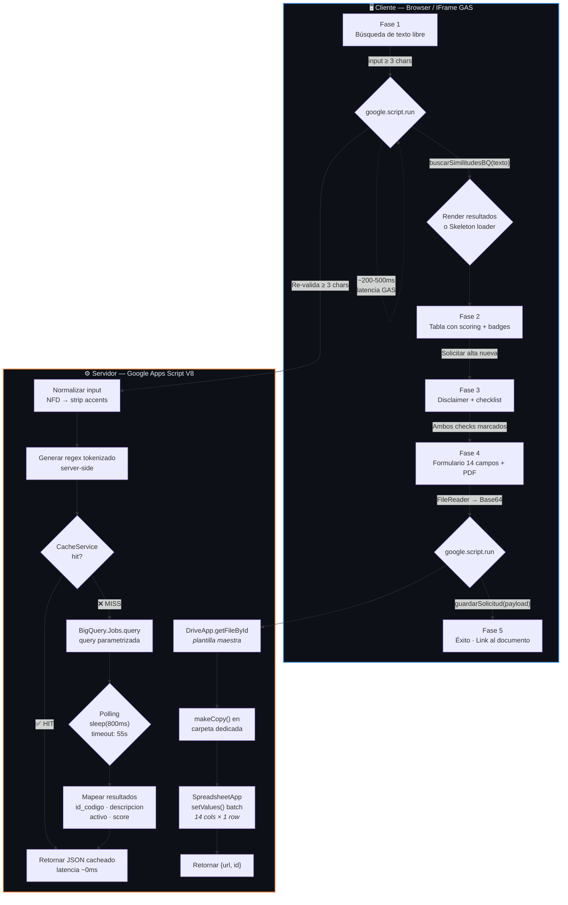

<p align="center">
  
</p>

<p align="center">
  
  
  
  
</p>

<br>

<div align="center">

  <!-- Logo institucional -->
  

  <h1 style="font-size: 2.5em;">
    <code>Verificador de Catálogo HCG</code>
  </h1>

  <p>
    <strong>Sistema institucional de prevención de duplicados</strong><br>
    <em>Búsqueda semántica · Validación normativa · Generación automática de formatos</em>
  </p>

  <br>

  <table>
    <tr>
      <td align="center">
        
      </td>
      <td align="center">
        
      </td>
      <td align="center">
        
      </td>
      <td align="center">
        
      </td>
    </tr>
  </table>

</div>

<br>

<p align="center">
  
</p>

<br>

<!-- ═══════════════════════════════════════════════════════════════ -->
<!-- NAVIGACIÓN RÁPIDA                                              -->
<!-- ═══════════════════════════════════════════════════════════════ -->

<div align="center">

<table>
<tr>
<td align="center" width="16%">
<a href="#visión-general">
<br><sub><b>General</b></sub>
</a>
</td>
<td align="center" width="16%">
<a href="#arquitectura">
<br><sub><b>Sistema</b></sub>
</a>
</td>
<td align="center" width="16%">
<a href="#motor-de-búsqueda">
<br><sub><b>Jaccard</b></sub>
</a>
</td>
<td align="center" width="16%">
<a href="#referencia-api">
<br><sub><b>Servidor</b></sub>
</a>
</td>
<td align="center" width="16%">
<a href="#interfaz-de-usuario">
<br><sub><b>Diseño</b></sub>
</a>
</td>
<td align="center" width="16%">
<a href="#seguridad">
<br><sub><b>Hardening</b></sub>
</a>
</td>
</tr>
<tr>
<td align="center">
<a href="#configuración">
<br><sub><b>Variables</b></sub>
</a>
</td>
<td align="center">
<a href="#despliegue">
<br><sub><b>Producción</b></sub>
</a>
</td>
<td align="center">
<a href="#estructura-de-archivos">
<br><sub><b>Proyecto</b></sub>
</a>
</td>
<td align="center">
<a href="#accesibilidad">
<br><sub><b>WCAG 2.1</b></sub>
</a>
</td>
<td align="center">
<a href="#troubleshooting">
<br><sub><b>Problemas</b></sub>
</a>
</td>
<td align="center">
<a href="#roadmap">
<br><sub><b>Futuro</b></sub>
</a>
</td>
</tr>
</table>

</div>

<br>

<p align="center">
  
</p>

---

## 🔎 Visión General

> **Verificador de Catálogo HCG** es una aplicación web SPA integrada en Google Apps Script que implementa un flujo normativo de **5 fases** para la prevención de duplicados en el catálogo maestro de bienes, servicios y activos del Hospital Civil de Guadalajara — conforme a la **Regla 2.5 y Artículo 10** de las Reglas de Operación del Subcomité.

<br>

<!-- ═══════════════════════════════════════════════════════════════ -->
<!-- STACK TÉCNICO                                                  -->
<!-- ═══════════════════════════════════════════════════════════════ -->

<div align="center">
<table>
<tr>
<td width="50%" valign="top">

<h4 align="center">🖥️ Frontend</h4>

<table>
  <tr>
    <td><b>Motor</b></td>
    <td>HTML5 Service (SPA monolítica)</td>
  </tr>
  <tr>
    <td><b>Estilos</b></td>
    <td>CSS vanilla · 35+ custom properties</td>
  </tr>
  <tr>
    <td><b>Lógica</b></td>
    <td>JavaScript ES2020 · ~400 LOC</td>
  </tr>
  <tr>
    <td><b>Tipografía</b></td>
    <td>Syne · DM Sans · JetBrains Mono</td>
  </tr>
  <tr>
    <td><b>Patrones</b></td>
    <td>BEM · Skeleton · Floating Labels</td>
  </tr>
  <tr>
    <td><b>Animaciones</b></td>
    <td>GPU-accelerated · <code>will-change</code></td>
  </tr>
</table>

</td>
<td width="50%" valign="top">

<h4 align="center">⚙️ Backend</h4>

<table>
  <tr>
    <td><b>Runtime</b></td>
    <td>Google Apps Script V8 (ES6+)</td>
  </tr>
  <tr>
    <td><b>DB</b></td>
    <td>BigQuery · Jaccard Trigramas</td>
  </tr>
  <tr>
    <td><b>Storage</b></td>
    <td>Drive API v3 + Sheets API v4</td>
  </tr>
  <tr>
    <td><b>Cache</b></td>
    <td><code>CacheService</code> · TTL 6h · MD5 key</td>
  </tr>
  <tr>
    <td><b>Acceso</b></td>
    <td><code>DOMAIN</code> · <code>USER_DEPLOYING</code></td>
  </tr>
  <tr>
    <td><b>Funciones</b></td>
    <td>3 públicas + 2 helpers privados</td>
  </tr>
</table>

</td>
</tr>
</table>
</div>

<br>

### 📊 Métricas de Diseño

<table>
<tr>
<td align="center">

**35+**

CSS Custom Properties

</td>
<td align="center">

**5**

Fases de flujo normativo

</td>
<td align="center">

**14**

Campos del formulario

</td>
<td align="center">

**WCAG 2.1 AA**

Accesibilidad

</td>
<td align="center">

**~200ms**

Cache hit latency

</td>
<td align="center">

**≤ 55s**

Timeout de servidor

</td>
</tr>
</table>

<br>

<p align="center">
  
</p>

---

## 🏗️ Arquitectura

### Diagrama de flujo de alto nivel



<br>

### 💎 Patrones de Diseño y Buenas Prácticas (V8)

Como solución de nivel empresarial en Google Apps Script, este proyecto implementa patrones estrictos para maximizar el rendimiento y respetar las cuotas del entorno:

- **Patrón Batching (Operaciones por Lotes):** En `generarDocumentoInclusion`, se realiza una única llamada a `setValues()` para volcar las 14 columnas de datos. Esto minimiza el overhead de comunicación con la API de Sheets.
- **Cache Layer:** Uso estratégico de `CacheService` con claves MD5 para evitar consultas repetitivas a BigQuery, reduciendo costos y tiempos de respuesta a ~0ms en hits.
- **Defensa en Profundidad (Validación):** Las restricciones de longitud y sanitización se aplican tanto en el cliente (UX inmediata) como en el servidor (integridad de datos).

<br>

<p align="center">
  
</p>

---

## 📂 Estructura de Archivos

```
hcg-catalogo-verifier/
│
├── appsscript.json                 ⚙️  Manifest del proyecto GAS
│   ├── runtimeVersion              →  "V8"
│   ├── webapp.executeAs            →  "USER_DEPLOYING"
│   ├── webapp.access               →  "DOMAIN"
│   └── dependencies.enabledAdvancedServices
│       ├── bigquery                 →  Búsqueda semántica
│       ├── drive                    →  Gestión de documentos
│       └── sheets                   →  Plantilla + generación
│
├── Code.gs                         🔧  Lógica del servidor (Google Apps Script)
│   │
│   ├── « Funciones públicas »
│   │   ├── doGet()                       Punto de entrada HTML Service
│   │   ├── buscarSimilitudesBQ()         Motor de búsqueda semántica
│   │   └── guardarSolicitud()            Orquestador de alta + documento
│   │
│   └── « Helpers privados »
│       ├── generarDocumentoInclusion()   Generador de Google Sheets
│       └── getCarpetaSolicitudes()       Gestor de carpeta Drive
│
├── index.html                      🎨  Interfaz completa (SPA · 5 fases)
│   │
│   ├── <style>                     →  CSS Inlined (Tokens + Layout)
│   ├── <body>                      →  HTML semántico con ARIA
│   └── <script>                    →  JS Cliente (Navegación + google.script.run)
│
├── .clasp.json                     🔗  Configuración de clasp (CLI de GAS)
│
└── .agents/
    └── rules/
        └── agent.md                🤖  Reglas para agentes de IA asistidos
```

<br>

<p align="center">
  
</p>

---

## 💻 Flujo de Desarrollo (CLASP)

Para mantener un estándar profesional, este proyecto se gestiona localmente utilizando `@google/clasp`. Esto permite el control de versiones con Git y evita el uso del editor web de GAS (antipatrón en producción).

### Comandos Clave

| Comando | Acción |
|:---|:---|
| `clasp login` | Autentica la sesión con tu cuenta de Google |
| `clasp pull` | Descarga los archivos del proyecto desde la nube |
| `clasp push` | Sube los archivos locales al proyecto en la nube |
| `clasp open` | Abre el proyecto en el editor web de Google Apps Script |

> [!CAUTION]
> No modifiques archivos directamente en el editor web de Google si estás usando el flujo local. Un `clasp push` sobrescribirá cualquier cambio no sincronizado en el servidor.

<br>

<p align="center">
  
</p>

---

## 🧬 Motor de Búsqueda

### Algoritmo: Coeficiente de Jaccard sobre Trigramas

> El motor de búsqueda implementa el **índice de Jaccard** (intersección sobre unión) aplicado sobre **trigramas** — subcadenas de 3 caracteres consecutivos extraídas mediante ventana deslizante.

<br>

<table>
<tr>
<td width="50%" valign="top">

<h4>Fórmula Matemática</h4>

<pre>
              |A ∩ B|
Jaccard = ─────────────────
           |A| + |B| - |A ∩ B|
</pre>

<h4>Equivalencia SQL</h4>

<pre><code>
ROUND(
  SAFE_DIVIDE(
    inter,
    len_cat + len_in - inter
  ) * 100, 1
) AS score
</code></pre>

<h4>Umbrales</h4>

<table>
  <tr>
    <th>Valor</th>
    <th>Acción</th>
  </tr>
  <tr>
    <td><code>≥ 60%</code></td>
    <td>🔴 Alta similitud — Badge rojo</td>
  </tr>
  <tr>
    <td><code>≥ 35%</code></td>
    <td>🟠 Similitud media — Badge ámbar</td>
  </tr>
  <tr>
    <td><code>≥ 15%</code></td>
    <td>⬜ Similitud baja — Badge gris</td>
  </tr>
  <tr>
    <td><code>&lt; 15%</code></td>
    <td>❌ Descartado — No se muestra</td>
  </tr>
</table>

</td>
<td width="50%" valign="top">

<h4>Pipeline SQL</h4>

<pre><code>
-- 1. NORMALIZACIÓN DEL INPUT
--    input → NFD → strip accents → UPPER
--    → SPLIT → FILTER(≥3 chars)

-- 2. GENERACIÓN DE TRIGRAMAS
--    Cada palabra → GENERATE_ARRAY(1, len-2)
--    → SUBSTR(word, i, 3)
--    → ARRAY_AGG(DISTINCT)

-- 3. PRE-FILTRADO DE CANDIDATOS
--    REGEXP_CONTAINS(regex)
--    → Reduce espacio de búsqueda

-- 4. CROSS JOIN + JACCARD
--    COUNT(inter) / (len_cat + len_in - inter)

-- 5. FILTRADO Y ORDENAMIENTO
--    WHERE inter > 0 AND score >= 15%
--    ORDER BY score DESC
--    LIMIT 10
</code></pre>

</td>
</tr>
</table>

<br>

### Optimizaciones de rendimiento

<table>
<tr>
<td align="center" width="6%"><b>#</b></td>
<td width="20%"><b>Técnica</b></td>
<td width="50%"><b>Implementación</b></td>
<td align="center" width="12%"><b>Impacto</b></td>
</tr>
<tr>
<td align="center">1</td>
<td><b>Cache en memoria</b></td>
<td><code>CacheService.getScriptCache()</code> con clave MD5 de 24 chars, TTL 6 horas</td>
<td align="center">🔴 Alto</td>
</tr>
<tr>
<td align="center">2</td>
<td><b>Filtro previo</b></td>
<td><code>REGEXP_CONTAINS</code> con regex tokenizado antes de calcular similitud</td>
<td align="center">🟡 Medio</td>
</tr>
<tr>
<td align="center">3</td>
<td><b>Limitación de input</b></td>
<td>Max 15 palabras · min 3 chars/palabra (previene regex explosivo)</td>
<td align="center">🟡 Medio</td>
</tr>
<tr>
<td align="center">4</td>
<td><b>Escritura por lotes</b></td>
<td><code>hoja.getRange(f, 3, 1, 14).setValues(batch)</code> — 1 sola llamada a Sheets</td>
<td align="center">🟢 Bajo</td>
</tr>
<tr>
<td align="center">5</td>
<td><b>Polling optimizado</b></td>
<td>Intervalo de 800ms (vs 400ms anterior) + timeout seguridad 55s</td>
<td align="center">🟢 Bajo</td>
</tr>
</table>

<br>

<p align="center">
  
</p>

---

## 📡 Referencia API

### Mapa de funciones del servidor

```
Code.gs
│
├── 🌐 PÚBLICAS (expuestas al cliente vía google.script.run)
│   │
│   ├── doGet()
│   │   └── Rol:      Punto de entrada · renderiza index.html
│   │
│   ├── buscarSimilitudesBQ(textoUsuario)
│   │   └── Rol:      Motor de búsqueda semántica (BigQuery + Cache)
│   │
│   └── guardarSolicitud(payload)
│       └── Rol:      Orquestador de alta + generación de documento
│
└── 🔒 PRIVADAS (helpers internos)
    │
    ├── generarDocumentoInclusion(datos, pdfBase64)
    │   └── Rol:      Clonación de plantilla y mapeo de celdas en Sheets
    │
    └── getCarpetaSolicitudes()
        └── Rol:      Garantiza la existencia de la carpeta en Drive
```

<br>

<p align="center">
  
</p>

---

## 🎨 Interfaz de Usuario

### Design Tokens (CSS Custom Properties)

| Token | Valor | Uso |
|:---|:---|:---|
| `--blue-main` | `#1e40af` | Acción principal / Color institucional |
| `--text-main` | `#111827` | Texto de alto contraste (WCAG AA) |
| `--bg-body` | `#f7f8fa` | Fondo de la aplicación |
| `--radius-win` | `16px` | Bordes redondeados de contenedores |

<br>

### Catálogo de componentes

<table>
<tr>
<td align="center" width="16%"><b>Componente</b></td>
<td width="84%"><b>Descripción</b></td>
</tr>
<tr>
<td align="center">🧭</td>
<td><b>Stepper horizontal:</b> 5 pasos con iconos contextuales SVG y <code>aria-current="step"</code> para accesibilidad.</td>
</tr>
<tr>
<td align="center">🔍</td>
<td><b>Search unified box:</b> Input y botón fusionados con feedback visual en focus.</td>
</tr>
<tr>
<td align="center">💀</td>
<td><b>Skeleton loader:</b> Shimmer CSS que disimula la latencia de red inherente a Apps Script.</td>
</tr>
</table>

<br>

<p align="center">
  
</p>

---

## ♿ Accesibilidad

### Cumplimiento WCAG 2.1 AA

- **Foco Teclado:** Trampa de foco en modales (Tab cicla y Escape cierra).
- **Contraste:** Todos los colores de texto y badges superan el ratio de 4.5:1.
- **Movimiento Reducido:** Soporte para `prefers-reduced-motion` que desactiva animaciones costosas.

<br>

<p align="center">
  
</p>

---

## 🔒 Seguridad

| Medida | Implementación | Riesgo mitigado |
|:---|:---|:---|
| **SQL Parametrizado** | Uso de parámetros nombrados en BigQuery | SQL Injection |
| **Escapado HTML** | Sanitización con `escapeHTML()` antes de insertar en el DOM | Cross-Site Scripting (XSS) |
| **Acceso Restringido** | Configuración `access: DOMAIN` en el manifest | Acceso no autorizado fuera del hospital |

<br>

<p align="center">
  
</p>

---

## ⚙️ Configuración

### Variables de Script (Script Properties)

| Variable | Descripción | Ejemplo |
|:---|:---|:---|
| `BQ_PROJECT_ID` | ID del proyecto en Google Cloud | `hcg-catalogo-prod` |
| `BQ_DATASET` | Nombre del dataset en BigQuery | `hcg_catalogo` |
| `BQ_TABLE` | Nombre de la tabla de artículos | `catalogo_articulos_v2` |

<br>

<p align="center">
  
</p>

---

## 🚀 Despliegue

### Despliegue Automatizado con CLASP (Recomendado)

1. **Subir cambios:**
   ```bash
   clasp push
   ```
2. **Crear versión web app:**
   ```bash
   clasp deploy --description "Despliegue Producción"
   ```

### Despliegue Manual (Fallback)

1. Abre el editor de Google Apps Script.
2. Pega el contenido de `Code.gs` e `index.html`.
3. Ve a **Implementar > Nueva implementación**.
4. Selecciona **Aplicación web**:
   - **Ejecutar como:** Yo (USER_DEPLOYING).
   - **Quién tiene acceso:** Cualquier persona con cuenta en el dominio.

<br>

<p align="center">
  
</p>

---

## 🛠️ Troubleshooting

| Problema | Causa | Solución |
|:---|:---|:---|
| Error de conexión en BQ | Permisos o ID de proyecto incorrectos | Verifica las Variables de Script y accesos en GCP. |
| El PDF no se adjunta | Excede el límite de 10MB | Reduce el tamaño del archivo antes de subirlo. |

<br>

<p align="center">
  
</p>

---

## 🗺️ Roadmap

- [x] Búsqueda semántica v1.0.
- [x] Generación de formatos Sheets.
- [ ] Autocompletado predictivo en el buscador.
- [ ] Dashboard de estadísticas de uso.

<br>

<p align="center">
  
</p>

<div align="center">

### 🏥 Propiedad del Hospital Civil de Guadalajara
**Uso interno restringido · Consultar con el área de TI antes de distribuir**

<br>
<br>


</div>
