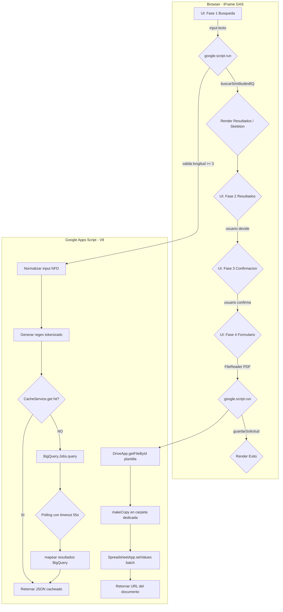
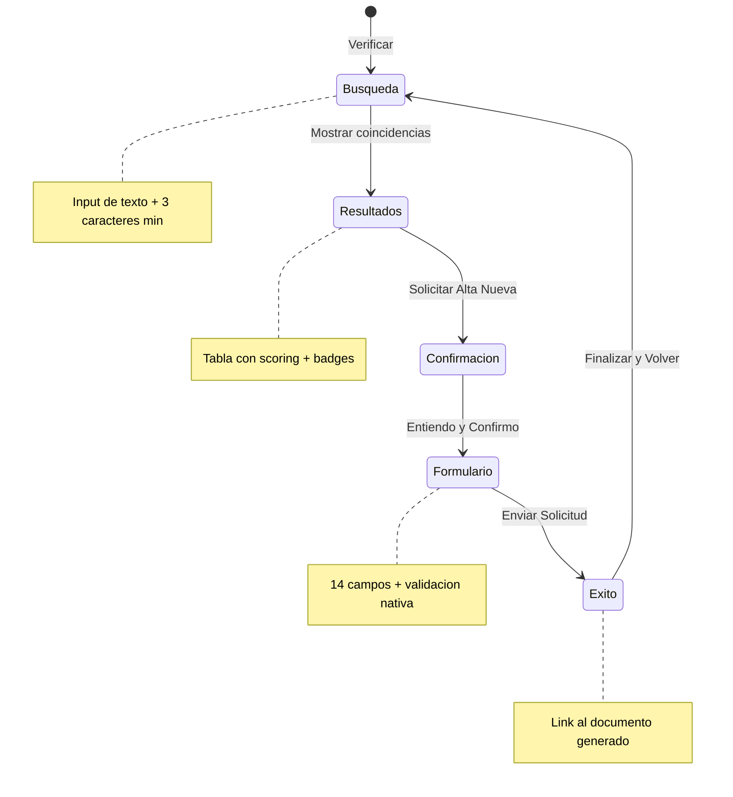

<p align="center">
  
  
  
  
  <br>
  
  
  
</p>

<h1 align="center">Verificador de Catalogo HCG</h1>
<p align="center">
  <strong>Busqueda semantica + Prevencion de duplicados + Generacion automatica de formatos de inclusion</strong>
</p>

---

## Tabla de Contenido

- [1. Descripcion General](#1-descripcion-general)
- [2. Arquitectura del Sistema](#2-arquitectura-del-sistema)
- [3. Estructura del Proyecto](#3-estructura-del-proyecto)
- [4. Configuracion](#4-configuracion)
- [5. Base de Datos BigQuery](#5-base-de-datos-bigquery)
- [6. API del Servidor (Code.gs)](#6-api-del-servidor-codegs)
- [7. Interfaz de Usuario (index.html)](#7-interfaz-de-usuario-indexhtml)
- [8. Seguridad](#8-seguridad)
- [9. Despliegue](#9-despliegue)
- [10. Solucion de Problemas](#10-solucion-de-problemas)
- [11. Roadmap](#11-roadmap)

---

## 1. Descripcion General

**Verificador de Catalogo HCG** es una Web App integrada en Google Apps Script que implementa un flujo de 5 fases para la prevencion de duplicados en un catalogo maestro hospitalario del Hospital Civil de Guadalajara (HCG).

El sistema permite:

1. **Buscar** articulos en tiempo real mediante similitud semantica contra BigQuery.
2. **Verificar** coincidencias con scoring Sorensen-Dice basado en trigramas.
3. **Confirmar** la responsabilidad del solicitante antes de crear una clave nueva.
4. **Registrar** la solicitud con formulario validado y documento adjunto.
5. **Generar** automaticamente un Google Sheets con los datos de inclusion.

### Stack Tecnico

| Capa           | Tecnologia                                                     |
| -------------- | -------------------------------------------------------------- |
| Frontend       | HTML5 Service + CSS vanilla (Flexbox/Grid) + JavaScript ES2020 |
| Backend        | Google Apps Script (V8)                                        |
| Base de Datos  | Google BigQuery (busqueda semantica)                           |
| Almacenamiento | Google Drive (documentos generados)                            |
| Cache          | `CacheService.getScriptCache()` (6 horas TTL)                  |
| Fuentes        | Google Fonts (DM Sans) + SVG inline                            |

---

## 2. Arquitectura del Sistema



### Flujo de Datos

```
Usuario ingresa texto
    │
    ▼
Cliente JS (index.html)
    ├── Normaliza: toUpperCase() → NFD → strip accents → filtro palabras >= 3 chars → max 15
    ├── Genera regex escapada: inputWords.map(escapeRegex).join('|')
    └── Invoca: google.script.run.buscarSimilitudesBQ(texto, regex)
         │
         ▼
Servidor GAS (Code.gs)
    ├── Re-valida longitud >= 3
    ├── Cache hit? → return JSON.parse(cached)  [latencia ~0ms]
    ├── Cache miss? → BigQuery.Jobs.query(queryParametros)
    │       ├── Parametro @q: texto original (sin normalizar)
    │       └── Parametro @regex: regex escapado para REGEXP_CONTAINS
    ├── Polling: Utilities.sleep(800ms) hasta jobComplete (max 55s)
    ├── Mapea resultados: id_codigo, descripcion, activo, score
    ├── Cache.put(cacheKey, JSON.stringify(results), 21600)
    └── return [{id_codigo, descripcion, activo, similitud}]
         │
         ▼
Cliente JS (index.html)
    ├── renderSkeleton() → renderResultados(data)
    │       └── Animacion stagger por fila (40ms delay)
    └── UX: skeleton → tabla con badges → actions
         │
         ▼ (si usuario decide solicitar alta)
Servidor GAS (Code.gs)
    ├── guardarSolicitud(payload)
    │       ├── getCarpetaSolicitudes() → DriveApp.getFoldersByName()
    │       ├── generarDocumentoInclusion(datosDoc, pdfBase64)
    │       │       ├── plantilla.makeCopy(nombre, carpetaDestino)
    │       │       ├── SpreadsheetApp.open(copia).getSheetByName('Formato')
    │       │       ├── hoja.getRange(14, 3, 1, 14).setValues(batch)
    │       │       ├── FileReader PDF → DriveApp.createFile(blob) (si existe)
    │       │       └── SpreadsheetApp.flush()
    │       └── return { success: true, url, id }
    └── Error handling: throw new Error(mensaje) → withFailureHandler
```

---

## 3. Estructura del Proyecto

```
├── appsscript.json          # Manifest del proyecto GAS
│   ├── runtimeVersion: "V8"
│   ├── webapp.executeAs: "USER_DELING"
│   ├── webapp.access: "DOMAIN"
│   └── dependencies.enabledAdvancedServices:
│       ├── BigQuery (busqueda)
│       ├── Drive    (documentos)
│       └── Sheets   (plantilla)
│
├── Code.gs                 # Logica del servidor (2 funciones publicas + 2 helpers)
│   ├── doGet()                    # Punto de entrada HTML Service
│   ├── buscarSimilitudesBQ()      # Motor de busqueda semantica
│   ├── guardarSolicitud()        # Orquestador de alta
│   ├── generarDocumentoInclusion() # Generador de documentos
│   └── getCarpetaSolicitudes()    # Gestor de carpeta Drive
│
└── index.html              # Interfaz completa (SPA de 5 fases)
    ├── <style>                # ~620 lineas CSS
    │   ├── Variables CSS (:root)
    │   ├── Layout (Flexbox/Grid)
    │   ├── Componentes (stepper, skeleton, modal, toast, badges)
    │   ├── Animaciones (CSS keyframes)
    │   ├── Responsive (@media max-width: 600px)
    │   └── Accesibilidad (prefers-reduced-motion)
    ├── <body>                 # HTML semantico con ARIA
    │   ├── Stepper de progreso (nav + aria-label)
    │   ├── Phase 1: Busqueda (input + loader + skeleton)
    │   ├── Phase 2: Resultados (tabla + badges + stagger animation)
    │   ├── Phase 3: Confirmacion (disclaimer warning)
    │   ├── Phase 4: Formulario (14 campos + validacion + file upload)
    │   └── Phase 5: Exito (animacion checkmark + link documento)
    └── <script>               # ~400 lineas JavaScript
        ├── Estado: flags de concurrencia, timeout, currentPhase
        ├── Navegacion: irFase(num, force) con transiciones bidireccionales
        ├── Busqueda: ejecutarBusqueda() con skeleton + timeout 30s
        ├── Renderizado: renderResultados(), renderSkeleton(), renderEmpty()
        ├── Validacion: enviarFormulario() con checkValidity + PDF validation
        ├── UI: showToast(), showModal(), ripple effect, updateCharCounter()
        ├── Utilidades: escapeHTML(), $ selector
        └── Eventos: DOMContentLoaded con Enter + ripple en botones
```

---

## 4. Configuracion

### 4.1 Propiedades del Script (Required)

Las siguientes propiedades deben configurarse en **Google Apps Script > Proyecto > Configuracion del proyecto > Variables de entorno**:

| Variable        | Descripcion                                   | Ejemplo                 |
| --------------- | --------------------------------------------- | ----------------------- |
| `BQ_PROJECT_ID` | ID del proyecto GCP donde reside BigQuery     | `hcg-catalogo-prod`     |
| `BQ_DATASET`    | Dataset de BigQuery con la tabla del catalogo | `hcg_catalogo`          |
| `BQ_TABLE`      | Tabla de BigQuery con los articulos           | `catalogo_articulos_v2` |
| `BQ_LOCATION`   | Region de BigQuery (default: US)              | `US`                    |

### 4.2 Archivos de Recursos (Required)

| Recurso                 | ID / Ruta                                      | Descripcion                        |
| ----------------------- | ---------------------------------------------- | ---------------------------------- |
| Plantilla Google Sheets | `1ZVwPuloDIcDfQJFuZs_AeEb8SH5TD0iRbEx3kER_GC8` | Hoja "Formato" con mapeo de celdas |
| Logo HCG                | `1DgdE3nJmkNA9fMq4OQHpYYExy7E_jsjF`            | Logo PNG servido desde Drive       |

### 4.3 Permisos OAuth

El script solicita los siguientes permisos al ejecutarse por primera vez:

| Permiso             | Justificacion                       |
| ------------------- | ----------------------------------- |
| `bigquery.readonly` | Ejecutar consultas SQL en BigQuery  |
| `bigquery.job`      | Crear y monitorear jobs de consulta |
| `drive.readonly`    | Leer la plantilla del catalogo      |
| `drive`             | Crear copias y subir PDFs           |
| `sheets.readonly`   | Abrir el documento generado         |

> **Nota:** Con `executeAs: "USER_DEPLOYING"`, los permisos se otorgan bajo la cuenta del usuario que despliega la app. Con `"ME"`, se ejecuta como el usuario activo.

---

## 5. Base de Datos BigQuery

### 5. Esquema de la Tabla

La tabla de BigQuery debe contener al menos estas columnas para que el script funcione correctamente:

```sql
CREATE TABLE `project.dataset.catalogo_articulos_v2` (
  id_codigo        STRING   NOT NULL,  -- Clave del articulo
  descripcion_articulo STRING   NOT NULL,  -- Descripcion del articulo
  activo          INT64     NOT NULL,  -- 1 = activo, 0 = inactivo
);
```

### 5. Algoritmo de Similitud

El motor de busqueda utiliza el **coeficiente de Sorensen-Dice** aplicado sobre trigramas (subcadenas de 3 caracteres):

```
Similitud = inter / (len_cat + len_in - inter) * 100

Donde:
  inter     = Trigramas en comun entre query y catalogo
  len_cat  = Total de trigramas del candidato
  len_in   = Total de trigramas del input
```

**Pipeline SQL:**

```
input_text
  → NORMALIZE → REGEXP_REPLACE(NFD) → UPPER
  → SPLIT(' ') → FILTRAR length >= 3 → DISTINCT
  → GENERATE_ARRAY(1, len-2) → SUBSTR(w, i, 3)  [trigramas]
  → ARRAY_AGG(DISTINCT)  [token set de entrada]

descripcion_articulo
  → MISMO PROCESO  [token set del candidato]

CROSS JOIN entre token sets → COUNT(inter) → SCORE
WHERE inter > 0 AND score >= 0.15
ORDER BY score DESC LIMIT 10
```

### 5. Optimizaciones de Rendimiento

| Tecnica                 | Implementacion                                                              |
| ----------------------- | --------------------------------------------------------------------------- |
| **Cache**               | `CacheService.getScriptCache()` con clave MD5 de 24 chars, TTL 6 horas      |
| **Filtro previo**       | `REGEXP_CONTAINS` con regex antes de calcular similitud (reduce candidatos) |
| **Limitacion de input** | Max 15 palabras, min 3 chars por palabra (previene regex explosivo)         |
| **Escritura por lotes** | `hoja.getRange(fila, 3, 1, 14).setValues(batch)` en una sola llamada        |
| **Polling optimizado**  | 800ms interval (vs 400ms anterior) + timeout de seguridad 55s               |

---

## 6. API del Servidor (Code.gs)

### 6.1 `doGet()`

Punto de entrada de la Web App. No recibe parametros. Devuelve `HtmlService.createHtmlOutputFromFile('index')` con metadata viewport.

```typescript
// Firma: doGet(): HtmlOutput
// Retorno: Interfaz HTML renderizada en iframe de GAS
```

### 6.2 `buscarSimilitudesBQ(textoUsuario)`

Motor de busqueda semantica. Es la unica funcion invocada por el cliente durante la fase de busqueda.

```typescript
// Firma: buscarSimilitudesBQ(textoUsuario: string): Object[]
// Retorno: Array de objetos con estructura:
//   { id_codigo: string, descripcion: string, activo: number, similitud: number }
// Errores: throw Error('BigQuery: mensaje') si la consulta falla o excede timeout
// Cache: Retorna resultados cacheados si existen (max 6h de antiguedad)
// Timeout: 55s max en servidor antes de lanzar Error
// Nota: La normalizacion NFD + strip accents ocurre en el servidor,
//       no en el cliente, para mantener consistencia con la cache
```

### 6.3 `guardarSolicitud(payload)`

Orquestador que valida, genera el documento y devuelve la URL del archivo creado.

```typescript
// Firma: guardarSolicitud(payload: Object): Object
// Retorno: { success: true, url: string, id: string }
// Side effects: Crea Google Sheet copia en Drive, sube PDF si existe
// Errores: throw Error si no puede acceder a Drive o crear documento
// Nota: Si payload es null/undefined, ejecuta verificacion de autorizacion Drive
```

**Estructura esperada de `payload`:**

| Campo                | Tipo   | Required | Transformacion                                            |
| -------------------- | ------ | -------- | --------------------------------------------------------- |
| `descripcion`        | string | Si       | `.trim().toUpperCase()`                                   |
| `unidadMedida`       | string | Si       | `.trim().toUpperCase()`                                   |
| `partidaCOG`         | string | Si       | `.trim().toUpperCase()`                                   |
| `unidadHospitalaria` | string | Si       | Sin transformar                                           |
| `familia`            | string | No       | `.trim().toUpperCase()`                                   |
| `nombreSolicitante`  | string | Si       | `.trim()` (preserva caso)                                 |
| `cargoSolicitante`   | string | No       | `.trim()` (preserva caso)                                 |
| `servicio`           | string | No       | `.trim()` (preserva caso)                                 |
| `precio`             | string | No       | Valor directo                                             |
| `proveedor`          | string | No       | `.trim().toUpperCase()`                                   |
| `justificacion`      | string | No       | `.trim()` (preserva caso)                                 |
| `observacion`        | string | No       | `.trim()` (preserva caso)                                 |
| `cotizacionPDF`      | string | No       | Base64 del PDF (sin prefijo data:application/pdf;base64,) |

### 6.4 `generarDocumentoInclusion(datos, pdfBase64)`

Genera el documento de inclusion a partir de la plantilla.

```typescript
// Firma: generarDocumentoInclusion(datos: Object, pdfBase64: string): Object
// Retorno: { url: string, id: string }
// Side effects: Crea copia en Drive + archivo PDF si existe
// Mapeo de celdas:
//   Fila 14, Columna C → P (14 columnas)
//   C: partida | D: familia | E: unidad | F: descripcion
//   G: unidadMedida | H: nombreSolicitante | I: cargo
//   J: servicio | K: costo | L: proveedor
//   M: fecha (new Date) | N: justificacion | O: observacion | P: urlPdf
```

### 6.5 `getCarpetaSolicitudes()`

Helper que obtiene o crea la carpeta dedicada en Drive para almacenar los documentos generados.

```typescript
// Firma: getCarpetaSolicitudes(): Folder
// Retorno: Folder de Drive con nombre "Solicitudes de Inclusion HCG"
// Comportamiento: getFoldersByName → next, else createFolder
```

---

## 7. Interfaz de Usuario (index.html)

### 7. Patrones de Diseno

| Patron                           | Implementacion                                                          |
| -------------------------------- | ----------------------------------------------------------------------- |
| **Single Page Application**      | Navegacion por fases con `display: none/flex`, sin recarga              |
| **Stepper horizontal**           | Indicador visual de progreso con estados: pendiente, activo, completado |
| **Transiciones bidireccionales** | `slideInForward` / `slideInBackward` con cubic-bezier(0.4,0,0.2,1)      |
| **Skeleton loader**              | Shimmer CSS con `translateX` para latencia BigQuery                     |
| **Modal custom**                 | Reemplaza `window.confirm()` con backdrop-filter blur + focus trap      |
| **Toast notifications**          | Con barra de progreso decreciente y auto-remocion a 3s                  |
| **Ripple effect**                | Micro-interaccion Material Design en todos los botones                  |
| **CSS Variables**                | 27 variables para consistencia de tema                                  |
| **BEM-like naming**              | `.stepper__step`, `.stepper__dot`, `.btn--loading`, `.toast__progress`  |

### 7. Estilos de Colores (Design Tokens)

| Token            | Valor     | Uso                                          |
| ---------------- | --------- | -------------------------------------------- |
| `--blue-main`    | `#0071e3` | Botones primarios, foco, links activos       |
| `--red-main`     | `#ff3b30` | Errores, campos invalidos, boton destructivo |
| `--green-main`   | `#34c759` | Exito, badges "Activo", confirmacion         |
| `--bg-body`      | `#f5f5f7` | Fondo exterior del body                      |
| `--border-color` | `#d2d2d7` | Bordes de inputs, tablas                     |
| `--text-muted`   | `#86868b` | Texto secundario, placeholders, labels       |

### 7. Diagrama de Fases de la SPA



### 7. Accesibilidad (WCAG 2.1)

| Criterio                    | Implementacion                                                        |
| --------------------------- | --------------------------------------------------------------------- |
| **2.1.2 No Keyboard Trap**  | Focus trap en modal (Tab cicla dentro del overlay)                    |
| **2.4.3 Focus Order**       | `irFase()` mueve foco al primer input de cada fase                    |
| **2.4.7 Focus Visible**     | `:focus-visible` con `box-shadow: 0 0 0 3px` en todos los inputs      |
| **4.1.3 Status Messages**   | `aria-live="polite"` en loader y resultados                           |
| **1.4.13 Content on Hover** | Tablas con `box-shadow: inset 3px 0` + `background: #f0f5ff`          |
| **2.3.3 Animation**         | `prefers-reduced-motion: reduce` con fallbacks para opacity/transform |
| **1.3.4 Orientation**       | Responsive con `max-width: 600px` y touch targets de 44px min         |

### 7. Metricas de Rendimiento CSS

| Patron       | Uso                                                                          | Propiedad GPU                    |
| ------------ | ---------------------------------------------------------------------------- | -------------------------------- |
| `transform`  | Transiciones de fase, scale en botones, posicionamiento de skeleton          | Compositor (60fps)               |
| `opacity`    | Fade in/out de fases, toasts, modal                                          | Compositor (60fps)               |
| `box-shadow` | Focus rings, hover en tablas, glow de stepper activo                         | Compositor (si no afecta layout) |
| `transition` | Solo en propiedades especificas (`border-color`, `box-shadow`, `background`) | N/A                              |

**Antipatrones evitados:**

- `transition: all` (solo en `.stepper__dot` pendiente de correccion)
- `background-color` animado (usa `opacity` o `transform` cuando es posible)
- `document.write()` / `innerHTML` con datos de usuario sin sanitizar

---

## 8. Seguridad

### 8.1 Sanitizacion de Entrada

| Componente                               | Riesgo                             | Mitigacion                                                  |
| ---------------------------------------- | ---------------------------------- | ----------------------------------------------------------- |
| Toast messages (`showToast`)             | XSS si `msg` contiene HTML         | `span.textContent = msg` (DOM API safe)                     |
| Tabla de resultados (`renderResultados`) | XSS si `descripcion` contiene HTML | `escapeHTML()` con escape de 5 caracteres (`& < > " '`)     |
| Disclaimer term                          | XSS si `searchInput` contiene HTML | `textContent` (no innerHTML)                                |
| Stepper checkmark                        | XSS si se usa `innerHTML`          | Usa `innerHTML` solo con `&#10003;` (entidad HTML conocida) |

### 8.2 Seguridad del Servidor

| Medida                   | Implementacion                                                                                           |
| ------------------------ | -------------------------------------------------------------------------------------------------------- |
| **Inyeccion SQL**        | Consultas parametrizadas con `queryParameters` (NAMED) — nunca concatenacion de strings SQL              |
| **Regex sanitizado**     | `escapeRegex()` escapa metacaracteres regex del input antes de pasarlo a BigQuery                        |
| **Limitacion de tokens** | Max 15 palabras, min 3 caracteres por palabra — previene regex excesivamente complejos (DoS en BigQuery) |
| **Timeout de servidor**  | 55s max de polling + `Utilities.sleep(800)` — previene ejecuciones infinitas que consumen cuota          |
| **XFrameOptions**        | `setXFrameOptionsMode(DEFAULT)` — permite incrustar en Google Sites pero con proteccion de frames        |

### 8.3 Integridad de Dominio

```json
{
  "webapp": {
    "executeAs": "USER_DEPLOYING",
    "access": "DOMAIN"
  }
}
```

Con `DOMAIN`, solo usuarios autenticados del dominio de Google Workspace pueden acceder a la aplicacion. Esto previene acceso publico no autorizado al endpoint de GAS.

---

## 9. Despliegue

### 9.1 Requisitos Previos

- Proyecto de Google Cloud con BigQuery habilitado
- Google Workspace con dominio configurado (para acceso `DOMAIN`)
- Cuenta de servicio con permisos: BigQuery, Drive, Sheets
- La plantilla de Google Sheets existente con la estructura esperada (hoja "Formato", 14 columnas desde columna C)

### 9.2 Pasos de Despliegue

```bash
# 1. Clonar el repositorio o copiar los archivos
git clone <repo-url> hcg-catalogo-verifier
cd hcg-catalogo-verifier

# 2. Abrir Google Apps Script
# Ir a https://script.google.com/home/projects/open?id=<PROJECT_ID>

# 3. Crear los 3 archivos
#    - index.html    → Contenido completo del frontend
#    - Code.gs         → Logica del servidor
#    - appsscript.json → Manifest del proyecto (ver seccion 4)

# 4. Configurar variables de entorno
#    Ir a Proyecto > Configuracion del proyecto > Variables de entorno
#    Agregar: BQ_PROJECT_ID, BQ_DATASET, BQ_TABLE, BQ_LOCATION

# 5. Actualizar ID de plantilla (si es necesario)
#    Buscar en Code.gs linea 233 y reemplazar con el ID correcto

# 6. Implementar autorizacion
#    Primera ejecucion: la app pedira permisos de BigQuery, Drive, Sheets
#    Aceptar todos los permisos solicitados

# 7. Desplegar como Web App
#    Implementar > Despliegue > Nueva implementacion > Web app
#    Configurar: Ejecutar como: "Yo" | Acceso: "Cualquier usuario del dominio"
#    Presionar Desplegar y copiar la URL publica
```

### 9.3 Configuracion de Activacion (Deploy Trigger)

La Web App no requiere un trigger programado ya que funciona como SPA. Sin embargo, para mantener la sesion activa y evitar que GAS elimine el estado en modo iframe:

```javascript
// Opcional: Agregar al final de Code.gs
// Esto forza un keepalive cada 5 minutos para mantener la sesion activa
function setupKeepAlive() {
  // No se recomienda en produccion con acceso DOMAIN
}
```

> **Nota sobre el iframe de GAS:** Google Apps Script renderiza la Web App dentro de un sandboxed iframe. La latencia por comunicacion `google.script.run` es inherente (~200-500ms por llamada). Todas las animaciones de la interfaz estan disenadas para disimular esta latencia (skeleton loader, timeout de 30s, estados de carga).

---

## 10. Solucion de Problemas

### Problemas Comunes

| Problema                                              | Causa Raiz                                                            | Solucion                                                                                        |
| ----------------------------------------------------- | --------------------------------------------------------------------- | ----------------------------------------------------------------------------------------------- |
| "Error en la busqueda: No se pudo conectar"           | BigQuery no accesible o `executeAs` incorrecto                        | Verificar permisos BigQuery y `BQ_PROJECT_ID`                                                   |
| La tabla aparece vacia pero el articulo existe        | Normalizacion NFD del servidor elimina acentos que el usuario ingreso | Los datos del input se normalizan en el servidor antes de buscar; coincide con la base de datos |
| El PDF no se sube                                     | El archivo excede 10 MB o `MIME type` incorrecto                      | Validar `file.size` y `file.type` antes de enviar                                               |
| Modal no se abre o cierra al hacer clic               | Conflicto de `z-index` con otro elemento del DOM                      | Verificar que no haya overlays con z-index >= 1000                                              |
| "La consulta tardo demasiado" en menos de 30 segundos | Timeout del cliente (30s) coincide con latencia real                  | Aumentar `SEARCH_TIMEOUT_MS` en JS o optimizar consulta SQL en BigQuery                         |
| Animaciones "trabadas" o parpadean                    | `prefers-reduced-motion` activo en el sistema del usuario             | Las animaciones respetan la media query `prefers-reduced-motion: reduce`                        |

### 10.1 Debug Mode

La Web App incluye un fallback para pruebas locales sin servidor GAS:

```javascript
// Si google.script.run no existe, la app entra en modo demo
// (simula busqueda vacia y envio exitoso sin llamar al servidor)
if (typeof google !== "undefined" && google.script && google.script.run) {
  google.script.run.buscarSimilitudesBQ(val);
} else {
  setTimeout(() => {
    clearTimeout(_searchTimer);
    _searchInProgress = false;
    setLoading(false);
    renderResultados([]); // Simula resultados vacios
  }, 1000);
}
```

Para activar este modo, abrir `index.html` directamente en el navegador (sin el servidor GAS).

---

## 11. Roadmap

### v1.0 (Actual) — Version Estable

- [x] Busqueda semantica con BigQuery
- [x] Score Sorensen-Dice con trigramas
- [x] Cache de resultados (6h)
- [x] Skeleton loader
- [x] Modal custom con focus trap
- [x] Toast con barra de progreso
- [x] Stepper de progreso
- [x] Formulario con validacion nativa + file upload PDF
- [x] Generacion automatica de Google Sheets
- [x] Carpeta dedicada en Drive
- [x] Responsive + Touch targets
- [x] Accesibilidad WCAG 2.1 (focus-visible, aria-live, reduced-motion)

### v1.1 (Planificado)

- [ ] Visualizacion de la similitud como porcentaje animado
- [ ] Paginacion de resultados (offset/limit en consulta SQL)
- [ ] Autocompletar sugerencias de busqueda desde BigQuery
- [ ] Soporte para catalogos multiples (dropdown selector)
- [ ] Historial de busquedas recientes (localStorage)
- [ ] Exportar resultados a Google Sheets o CSV

### v2.0 (Futuro)

- [ ] PWA: Service Worker + cache offline
- [ ] REST API propia como backend (reemplazar google.script.run)
- [ ] Dashboard de administracion con metricas de uso
- [ ] Sistema de aprobacion de solicitudes (workflow)
- [ ] Integracion con Gmail API para notificaciones automaticas

---

## Licencia

Este proyecto es propiedad del Hospital Civil de Guadalajara. Uso interno restringido. Consultar con el area de TI antes de distribuir.

---

<p align="center">
  <sub>Generado con auditoria de codigo completo | v1.0 | Mayo 2026</sub>
</p>
